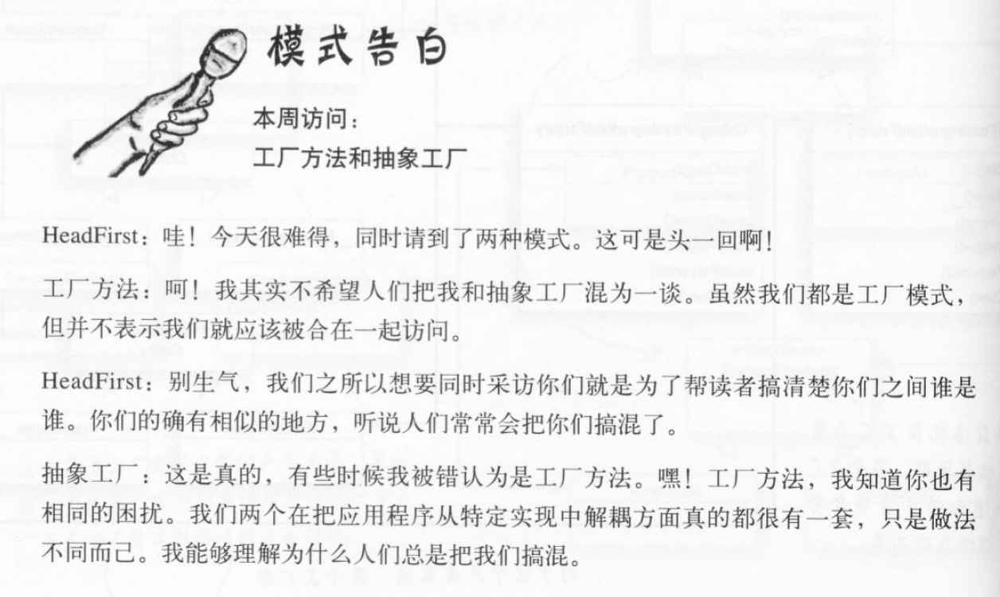
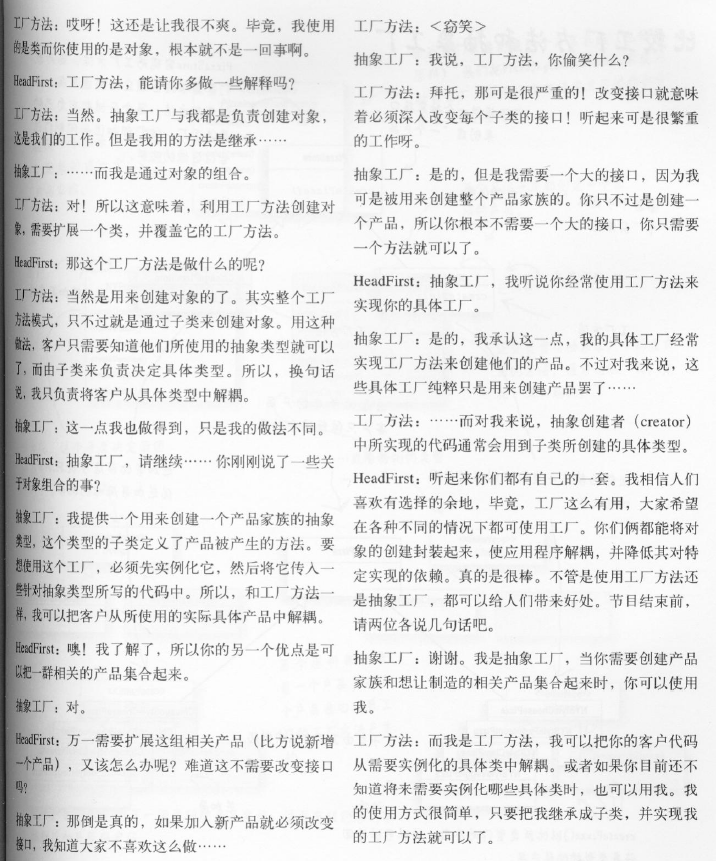

### 工厂模式

**简单工厂**其实不是一个设计模式，反而比较像是一种编程习惯。

工厂类 / 工厂方法

所有工厂模式都用来封装对象的创建。

工厂方法模式(Factory MethodPattern)通过让子类决定该创建的对象是什么，来达到将对象创建的过程封装的目的。

**抽象工厂模式**提供一个接口，用于创建相关或依赖对象的家族，而不需要明确指定具体类。

创建者类(Creator): 定义一个抽象的工厂方法，让子类实现此方法制造产品。

产品类: 具体的产品

